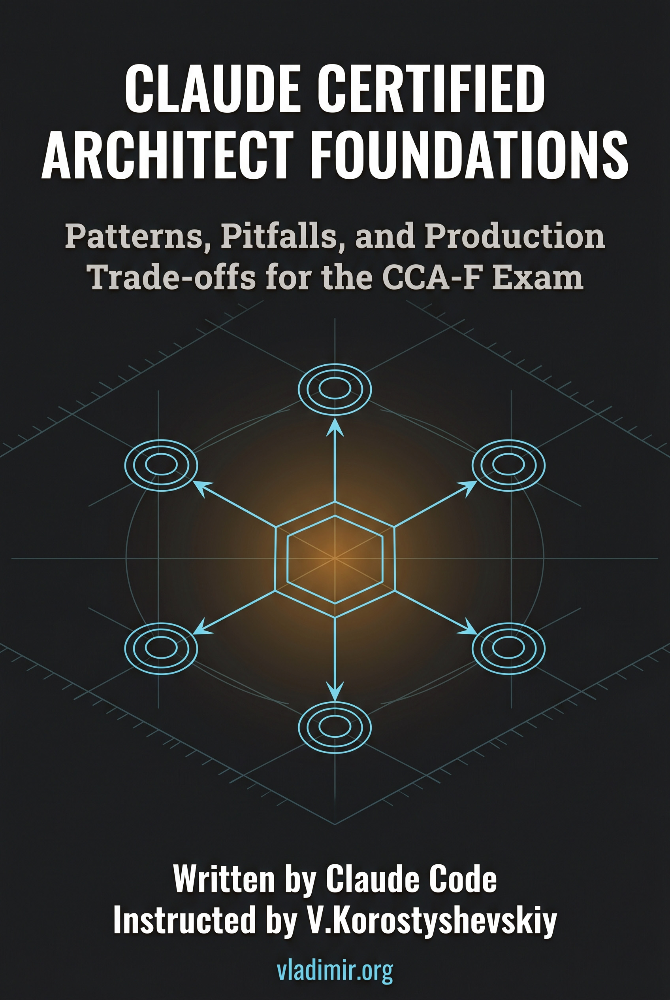

# Claude Certified Architect Foundations

A practitioner reference for the Anthropic CCA-F certification exam: patterns, pitfalls, and production trade-offs across all five exam domains. 12 chapters covering the agentic loop, tool design, configuration hierarchies, prompting discipline, context management, and reliability engineering for Claude Code and the Claude platform.

The editorial position is this: the CCA-F exam tests whether you understand why things work the way they do, not just what the correct configuration looks like. The book treats each exam domain as an engineering design space with trade-offs rather than a feature checklist with correct answers.

## Why this exists

I wanted a structured understanding of Claude Code's architecture and the design decisions underneath it, specifically as preparation for the CCA-F certification exam. The official documentation is comprehensive but distributed across multiple sites and organized by feature rather than by the conceptual relationships between features. The fastest way to build a unified mental model was to assemble the primary sources into a research corpus and have Claude synthesize it under explicit editorial constraints. After reading what came out, I figured other practitioners preparing for the exam might find it useful, and put it here.

## How it was made

I used [site2vault](https://github.com/vkorost/site2vault), my own documentation-to-Obsidian converter, to pull down the primary documentation sources into structured, searchable local vaults with manifests for section-level reads.

The research corpus spans:

| Source | Type | Coverage |
|--------|------|----------|
| claudecertifications.com | site2vault | Full certification site |
| docs.anthropic.com | site2vault | Claude documentation |
| platform.claude.com | site2vault | Platform documentation |
| Official CCA-F Exam Guide | PDF/markdown | Full exam guide |

The book itself was assembled with Claude using techniques described in [weekend-diy-book](https://github.com/vkorost/weekend-diy-book): style condensation, per-chapter assembly under explicit constraints, dedup, multi-pass review, editorial revision, and final DOCX/PDF/EPUB generation, orchestrated as a multi-phase pipeline with 18 sequential sub-agents.

## The Five Domains

The book is organized around the five CCA-F exam domains, each mapped to specific chapters:

- **Domain 1: Agentic Architecture** (27%, Chs 1-3): the agentic loop as a control-flow primitive, hub-and-spoke topology as the canonical multi-agent pattern, and hooks as lifecycle intervention points. The structural foundation that every other domain builds on.
- **Domain 2: Tool Design** (18%, Chs 4-5): what makes a tool get selected by the model, the description-over-name principle, MCP as an open protocol versus the built-in toolkit, and the boundaries between server-side and client-side tool execution.
- **Domain 3: Configuration and Customization** (20%, Chs 6-8): the CLAUDE.md hierarchy and its merge semantics, slash commands and skills as user-facing extensibility, plan mode as a gate on execution, and Claude Code operating headlessly in CI/CD pipelines.
- **Domain 4: Prompting and Output** (20%, Chs 9-10): prompt engineering as constraint specification rather than persuasion, structured output with schema-driven validation, and the validation loop pattern for self-correcting generation.
- **Domain 5: Context Management and Reliability** (15%, Chs 11-12): context window discipline as an engineering practice rather than a capacity problem, escalation patterns, provenance tracking, and error propagation across agent boundaries.

Each chapter introduces one or two named concepts as cognitive handles. These are not conclusions; they name the point where the engineering discipline forks and the principled decision must be made.

## What's in this repo

- `README.md`: this file.
- [`book/Claude-Certified-Architect-Foundations.pdf`](./book/Claude-Certified-Architect-Foundations.pdf): PDF for offline reading and print.
- [`book/Claude-Certified-Architect-Foundations.epub`](./book/Claude-Certified-Architect-Foundations.epub): EPUB for e-readers.
- `book/chapters/`: the 12 chapters as individual Markdown files, plus front matter (preface, how-to-read, about-the-certification), back matter (scenario reference, coverage map, glossary), and Appendix G (endnotes).
- [`LICENSE-CODE`](./LICENSE-CODE): MIT License for code samples.
- [`LICENSE-PROSE`](./LICENSE-PROSE): CC BY-NC-SA 4.0 for prose content.

The raw documentation vaults, the assembly pipeline instructions, and the working files (style constraints, registry, reviewer reports, pipeline state) are not published. Only the book and this description are here.

## Coverage cutoff

Documentation sources were consulted through Q2 2026. Claude Code, CLAUDE.md semantics, MCP, and the broader Claude platform are under active development. The book documents behavior as of its writing date. Readers should verify time-sensitive claims against current documentation before relying on them for production decisions or exam preparation.

## AI assistance, scope of

Claude was used for research synthesis, prose generation in a defined voice (Michael Lopp engineering essay style with named-pattern discipline), per-chapter assembly under explicit constraints with anti-repetition registry enforcement, and generating the endnotes apparatus. The multi-agent pipeline included a Style Agent, Grounding Agent, Registry Agent, 12 Writer Agents, 12 Fact-Trace Agents, an Endnotes Compiler, a Dedup Agent, two Reviewer Agents, an Editor Agent, and a Revision Agent, all running sequentially. Editorial decisions about structure, framing, and which positions to include were mine. Fact-checking was bounded by the source corpus.

## What's not in scope

This is not a Claude Code tutorial. It is not a getting-started guide. It is not a prompt cookbook. It is not an API reference. The reader is assumed to have used Claude Code at least once and to understand what an LLM, a tool call, and an agent loop are. The book does not teach you to use Claude; it teaches you to reason about why Claude's architecture works the way it does, which is what the exam tests.

## Disclaimer

This repository is an independent, unofficial study guide. It is not produced, endorsed, sponsored, or reviewed by Anthropic. "Claude" and "Claude Certified Architect" are trademarks of Anthropic, PBC, used here for descriptive reference only.

## Author

I am not employed by Anthropic or any AI vendor. The book was produced independently and does not represent any company's views. The analytical framework, the named patterns, and the structural argument are original to this work. The facts are drawn from the cited public corpus.

## License

This repository contains two distinct kinds of content, licensed differently.

- **Code** (all source files and code samples) is licensed under the **MIT License**. See [`LICENSE-CODE`](./LICENSE-CODE).
- **Prose** (all chapter `.md` files, written explanations, and accompanying instructional materials) is licensed under **Creative Commons Attribution-NonCommercial-ShareAlike 4.0 International (CC BY-NC-SA 4.0)**. See [`LICENSE-PROSE`](./LICENSE-PROSE).

In practice: the code is free to use, modify, and incorporate into any project, commercial or otherwise. The prose may be shared and adapted for non-commercial purposes with attribution; commercial reuse or redistribution of the written content (including republication as a book, course, or paid resource) is not permitted, and any derivative prose must carry the same CC BY-NC-SA 4.0 license.

---

